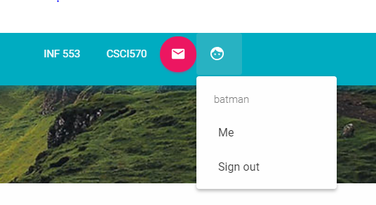
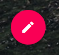
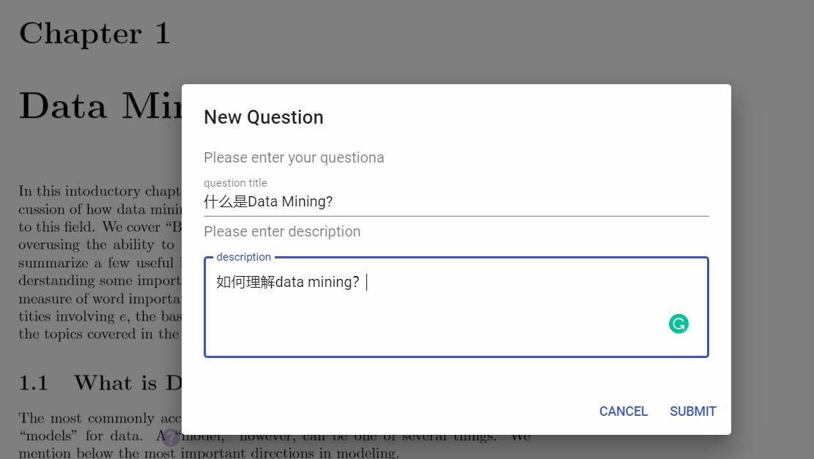
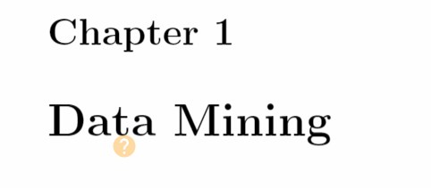
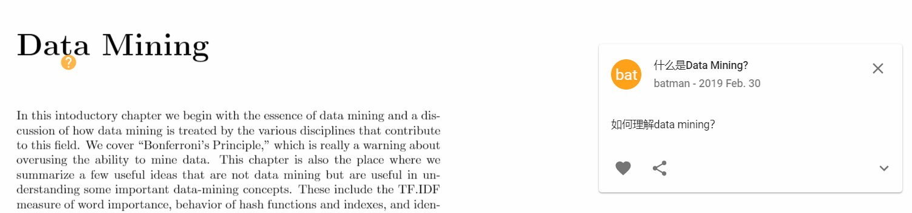
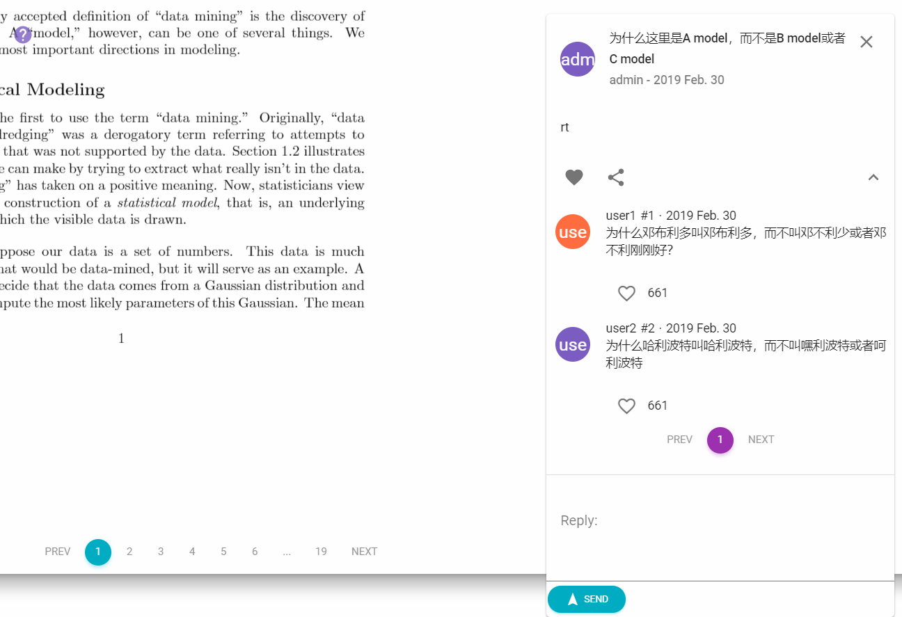
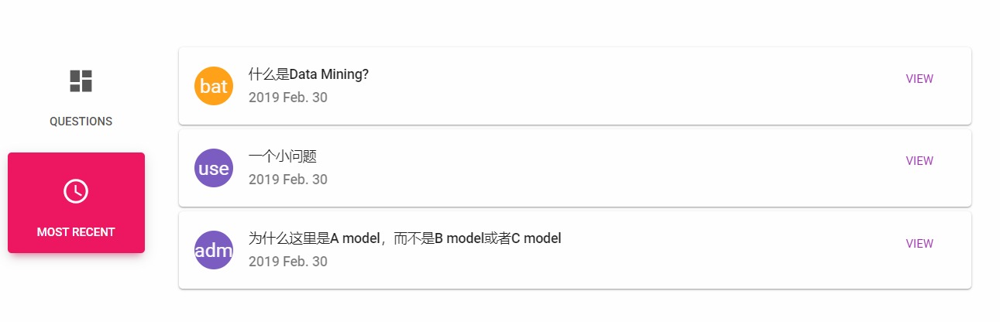
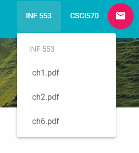

URL: www.course-reader.com

开发环境： reactjs + material UI + VS code + Express + nginx + AWS ec2 + mysql

# Course Reader 使用说明

这个小网站的主要功能是让在深夜中孤独地读着reading material的你不再孤单，你能在阅读材料旁做下备注，解决他人的问题或者提出问题，阅读更加有效率。

## 功能说明

### 注册备注，解决他人的问题

为了让大家知道谁是谁，希望大家使用真名，当然，你也可以成为歌谭市的蝙蝠侠，在黑暗之中用自己的键盘为同学解决问题。
————————————————————————————————————————————————————————————————————————————————————————————————————————

————————————————————————————————————————————————————————————————————————————————————————————————————————

### 登录

注册完成之后，就能用刚刚的用户名与密码登录了，密码采用了md5进行了加密

————————————————————————————————————————————————————————————————————————————————————————————————————————

————————————————————————————————————————————————————————————————————————————————————————————————————————

登录之后点击右上角的头像图标查看自己当前的用户名或者登出

————————————————————————————————————————————————————————————————————————————————————————————————————————

————————————————————————————————————————————————————————————————————————————————————————————————————————

### 提问

进入主界面，即可开始阅读课后材料，遇到不懂的地方，点击右边图标,
图标高亮时代表可以提问，任意点击pdf上的某个地方，即可提出问题：

————————————————————————————————————————————————————————————————————————————————————————————————————————

————————————————————————————————————————————————————————————————————————————————————————————————————————

填写好标题和描述之后，点击提交，即可提交问题，这时，你点击的地方会多出一个浅色的小问号：

————————————————————————————————————————————————————————————————————————————————————————————————————————

————————————————————————————————————————————————————————————————————————————————————————————————————————

每一个小问号代表有人提出了一个小问题等待回答，如果你知道答案，即可回复进行评论：

### 查看问题及回复

点击任何一个小问号，小问号便会高亮，同时在右侧显示问题：
————————————————————————————————————————————————————————————————————————————————————————————————————————

————————————————————————————————————————————————————————————————————————————————————————————————————————
当然，你还可以观看其他问题以及同学对此的回复：

————————————————————————————————————————————————————————————————————————————————————————————————————————

————————————————————————————————————————————————————————————————————————————————————————————————————————

### 底部栏

底部分为上下两个部分，上为当前page中的问题，下为最新提出的5个问题：
————————————————————————————————————————————————————————————————————————————————————————————————————————

————————————————————————————————————————————————————————————————————————————————————————————————————————
点击view按钮，可以快速定位到该问题

### 顶部导航栏

导航栏主要是用来切换不同的pdf，目前只支持INF551于CSCI570两门课：
————————————————————————————————————————————————————————————————————————————————————————————————————————

————————————————————————————————————————————————————————————————————————————————————————————————————————

## 结束语
如果遇到bug可以及时联系我，微信： yjf27281181，或者直接在github里提交bug，项目前端源码已经在上面了，大部分UI界面都是material UI的组件，但是感觉文档和使用感上不如NGZORRO，但是比NGZORRO好看。如果喜欢本项目麻烦star+fork支持一下！

